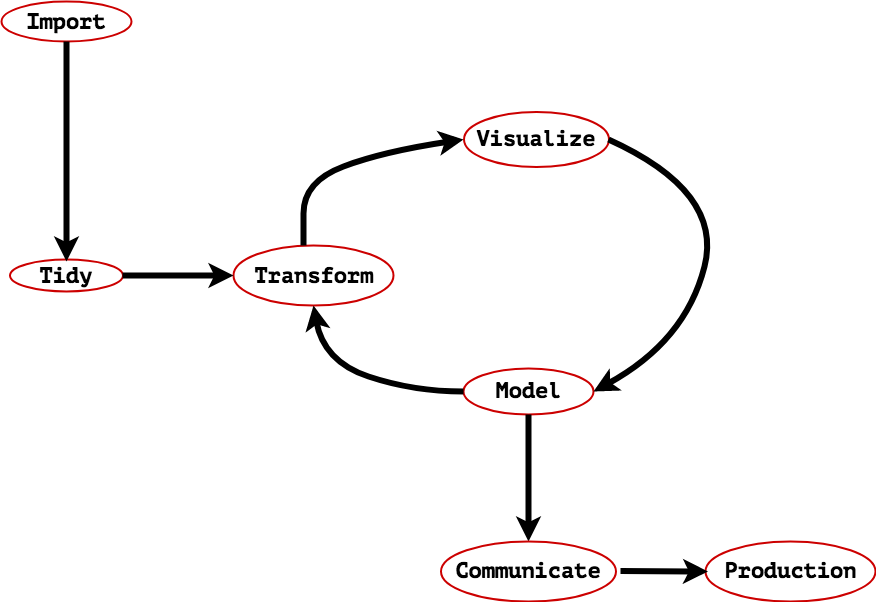

Data Understanding
====================

* Click this icon  to open the notebooks in a web browser without installing any software.

<figcaption>Haystax's Data Science Workflow.</figcaption>

What's the purpose of this project?
-----------------------------------

This repository provides the Jupyter Notebooks for performing modeling tasks such as:   
* Data import
* Data cleaning and tidying
* Data transformation
* Data visualization

Why was this project was started?
---------------------------------

Some of our clients are interested in a basic understanding of thier data through metrics such as descriptive statistics. Previously, we were skipping these steps when we went from ingesting data into the Bayesian model and getting risk scores. Why not look at the data as well and see what they say.
1. Do descriptive statistics to see what's unusual.
2. Share that with the customer easily
3. These statistics may inform our tweaks to the algorithms in the Bayesian model.

The success of this task is driven by having clients give us data in our standard format. So the Jupyter notebook can run each data source with limited modifications to it.

Getting help
------------

Incase you need help running these Jupyter Notebooks or have general questions, don't hesitate to reach out to the Data Science team at <demaasit@haystax.com> or <dkj@haystax.com>.
